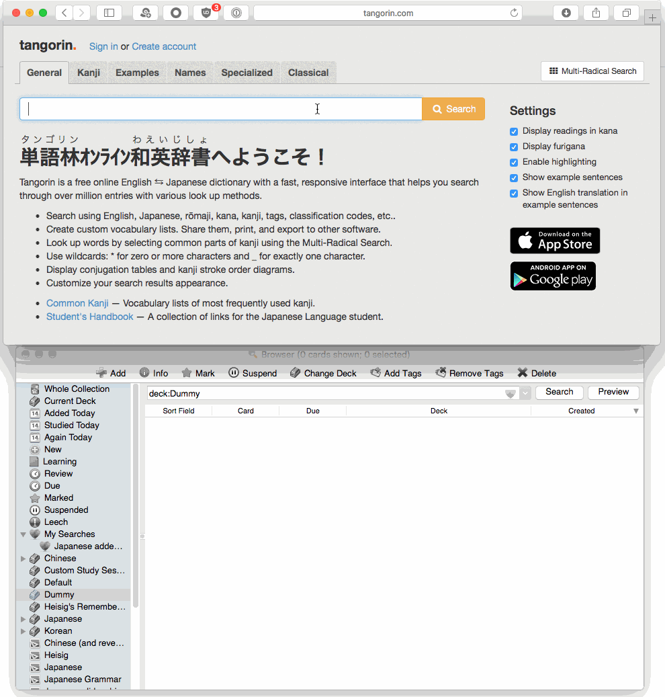

# Ankimo

Browser extension for sending Japanese words to Anki



## Usage

Currently works on

- http://tangorin.com


## Installation

Install [AnkiConnect](https://ankiweb.net/shared/info/2055492159)

- [Safari](https://github.com/dvcrn/ankimo/releases/latest)
- [Chrome](https://chrome.google.com/webstore/detail/ankimo/mgcnkmjoaekofcajlgmakljhennlhjod)

### Configuration

Open the settings and set up the field mappings correctly. 

- In Safari, hit `CMD-,` and go to 'Extensions'
- In Chrome, right-click the Ankimo icon and click 'Options'

## Developing

### Requirements

Ankimo is written in ClojureScript 

- https://leiningen.org
- Java 8


### Building

To build the extensions once:
```
lein cljsbuild once
```

To watch for changes and automatically rebuild:
```
lein cljsbuild auto
```

Ankimo has 2 components: 
- a main component that runs in the background (background page in chrome, global page in safari) 
- a worker component that is getting injected into the actual website

Most worker code between browsers is shared inside `worker/common` with browser specific code being in `worker/chrome`, `worker/safari` and so on. 

To only build for one specific browser, check the specific build targets inside `project.clj`. For safari you could do
```
lein cljsbuild once safari-worker safari-main

# or
lein cljsbuild auto safari-worker safari-main
```

## License

MIT

